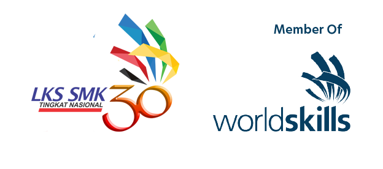

# LKSN2022

<tr>

This is a mini repository of all CTF Jeopardy challenges from Day 2 and Day 3 of LKSN 2022. All the participants are high-schoolers and vocational high-schoolers.

The categories of the challenges are:
* Offensive VM (BlackBox-Style Boot2Root)
* Infrastructure Hardening (Same VM)
* Binary Exploitation
* Reverse Engineering
* Web Exploitation
* Forensics (Memory + Android Images)
* Cryptography

Most of the problem setters are currently Stanley Halim (Enryu#7942), Chrisando Pardomuan (siahaan#9550), and me. One VM is created by the judges.
Most of the challenges can be downloaded from the challenges folder and all the solvers are coming soon.

